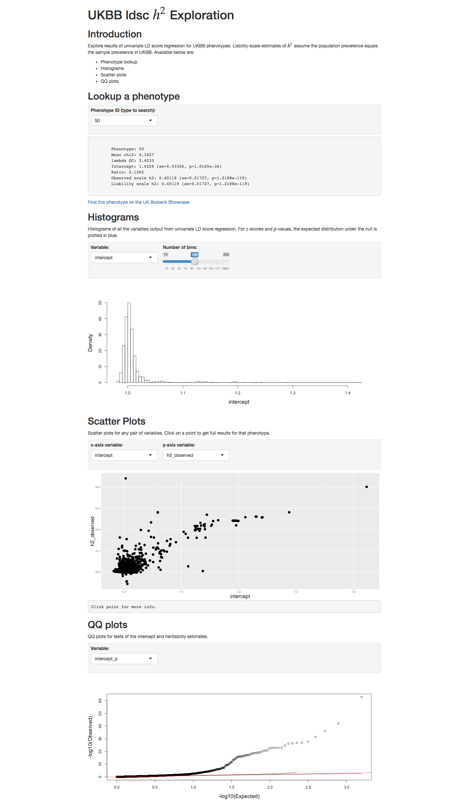

# UKBB ldsc scripts

Scripts used for running LD score regression ([LDSC](https://github.com/bulik/ldsc)) to estimate SNP-heritability in UK Biobank. These are mostly intended for documentation purposes, and may take some work to get running or adapt to other applications. 

# Table of Contents

* [Usage](#usage)
  * [Requirements](#requirements)
  * [Setup (create\_hm3\_keytable\.py)](#setup-create_hm3_keytablepy)
    * [Generated reference files](#generated-reference-files)
    * [Munged sumstats files](#munged-sumstats-files)
  * [Running ldsc (ldsc\_h2\_parallel\_batch\.py)](#running-ldsc-ldsc_h2_parallel_batchpy)
    * [Implementation Note](#implementation-note)
    * [Settings](#settings)
    * [Submission script (ldsc\_h2\_parallel\_batch\_submit\.sh)](#submission-script-ldsc_h2_parallel_batch_submitsh)
  * [Aggregating results (agg\_ldsc\.sh)](#aggregate-results-agg_ldscsh)
  * [Exploring h2 results (ukbb\_h2\.Rmd)](#exploring-h2-results-ukbb_h2rmd)
* [Results](#results)

TOC created with [gh-md-toc](https://github.com/ekalinin/github-markdown-toc.go)


# Usage

## Requirements

Broadly, the core scripts here depend on:

* [Google Cloud Platform](https://cloud.google.com/), for storage and compute
* [cloudtools](https://github.com/Nealelab/cloudtools), for interaction with google dataproc
* [Hail](https://hail.is/), for cloud compute support
* [MTAG](https://github.com/omeed-maghzian/mtag), for it's modified implementation of [LDSC](https://github.com/bulik/ldsc)

See the respective scripts for more info.

## Setup (`create_hm3_keytable.py`)

Creates a Hail keytable ([docs](https://hail.is/docs/stable/hail.KeyTable.html)) of HapMap3 SNPs passing QC in UKBB that can be used for LD score regression. This takes the place of the filtering normally performed in `munge_sumstats.py` ([see code from ldsc](https://github.com/bulik/ldsc/blob/master/munge_sumstats.py)). Variants in the resulting list are:

* Sites in HapMap release 3, version 3
* Autosomal, biallelic SNPs
* Present in UKBB, based on matching chr:pos:ref:alt
* Passing basic QC in the UKBB GWAS sample, including restricting the HRC sites (see [UKBB_Hail](https://github.com/Nealelab/UKBB_Hail))
* Additionally passing LDSC QC thresholds of: INFO > 0.9, MAF > 0.01

The resulting keytable is stored at `gs://ukbb_association/ldsc/ld_ref_panel/hm3.r3.hg19.auto_bi_af.ukbb_gwas_qcpos.kt
` and has the following schema:
```
Struct{v_hm3:Variant,HM3_rsid:String,v_ukb:Variant,UKBB_rsid:String}
```
The two variant encodings managing the differences in contig labels between the HM3 VCF and UKBB (i.e. leading "chr", leading 0 on chrosomes 1-9).

### Generated reference files

In addition to the final keytable of HM3 variants passing QC to use for LDSC, serveral interim files are generated that may be of more general interest:


* Cloud copy of the HapMap3 sites VCF
```
HapMap3 vcf (from ftp.broadinstitute.org/bundle/hg19/):
gs://ukbb_association/ldsc/ld_ref_panel/hapmap_3.3_hg19_pop_stratified_af.vcf.gz
```

* HapMap3 sites file in VDS format
```
HapMap3 full vds: 
gs://ukbb_association/ldsc/ld_ref_panel/hm3.r3.hg19.vds
```

* Keytable of autosomal, biallelic HapMap3 SNPs, including allele frequencies by population
```
HapMap3 autosomal, biallelic SNPs with freqs keytable:
gs://ukbb_association/ldsc/ld_ref_panel/hm3.r3.hg19.auto_bi_af.kt
```

* Keytable of HapMap3 SNPs passing QC in the full UKBB data (i.e. not filtered to unrelated, European ancestry, etc)
```
HapMap3 SNPs passing UKBB full cohort QC:
gs://ukbb_association/ldsc/ld_ref_panel/hm3.r3.hg19.auto_bi_af.ukbb_full_qcpos.kt
```


### Munged sumstats files

This final QC+ keytable (`hm3.r3.hg19.auto_bi_af.ukbb_gwas_qcpos.kt`) is then used the generate ldsc sumstats files (format described [here](https://github.com/bulik/ldsc/wiki/Summary-Statistics-File-Format)) as part of the GWAS output from UKBB. In the few instances where rsids for the same chr:pos:ref:alt differ between HM3 and UKBB, the output sumstats files use the rsid reported by UKBB.

These files are presently stored in:
```
gs://ukbb-gwas-results/ldsc/
```


## Running ldsc (`ldsc_h2_parallel_batch.py`)

This script runs [ldsc](https://github.com/bulik/ldsc) to estimate SNP-heritability for a batch of phenotypes using [MTAG](https://github.com/omeed-maghzian/mtag) with the standard default `eur_w_ld_chr` pre-computed European population LD scores. We use the version of ldsc provided with MTAG to take advantage of it's interface for calling ldsc from within python rather than via ther command line. Results are parsed into a gzipped tsv with columns:

```
phenotype, mean_chi2, lambdaGC, intercept intercept_se, intercept_z, intercept_p, ratio, ratio_se, h2_observed, h2_observed_se, h2_liability, h2_liability_se, h2_z, h2_p
```

Conversion to liability-scale h2 for dichotomous traits is done assuming that the population prevelence is equal to the prevelence in the UKBB GWAS sample. 


### Implementation Note

This is almost certainly not the ideal way to strcture this analysis. Making a human manage the splitting/batching here somewhat defeats the purpose of having flexible cloud compute. We're conly doing it this way currently for expediency while we investigate better long-term alternatives.

With the current settings in the submission script this takes a little over 10 CPU hours split over 10 minimal `n1-highcpu-16` VMs, each running 8 traits in parallel at a time. Attempts to scale this up to more traits on a machine (with 32- or 64-core VMs) have seen poor performance, likely due to being I/O bound for reading reference and sumstat files. 


### Settings

Using this script involves both setting job information in the script and passing arguments for parallelization via the command line. The following setting are set by editing the the python script (`ldsc_h2_parallel_batch.py`):

```
ld_ref_panel = '/home/mtag/mtag-master/ld_ref_panel/eur_w_ld_chr/' # local path
phen_summary = 'gs://ukbb-gwas-results/ukb1859/ukb1859_phenosummary_final.tsv' # in cloud
num_phens = 1564
ss_bucket = 'gs://ukbb-gwas-results/ldsc' # 'gs://ukbb_association/ldsc/sumstats' # bucket with sumstats.gz files
out_bucket = 'gs://ukbb-gwas-results/ldsc_results' # ouput google bucket location
num_proc = 8 # number of processes to run
```

From the command line, this script expects:
* `--parsplit INT`, the number of parallel batches to split phenotypes into
* `--paridx INT`, the index of the current batch amoung the `parsplit` batches

It's assumed that there are `num_phens` phenotypes in the `phen_summary` file and they they all have ldsc sumstats results files in the specified bucket. The mapping between the phenotypes names and the filenames for the sumstats files is hardcoded in the script (see `ss_name`, currently around line 176).

Within an instance of `ldsc_h2_parallel_batch.py`, it will estimate h2 for `num_proc` phenotypes at a time in parallel, and continue running until it's share of the `num_phens` phenotypes is finished.


### Submission script (`ldsc_h2_parallel_batch_submit.sh`)

**WARNING: THIS SCRIPT WILL CREATE NEW CLUSTERS BUT WILL NOT SHUT THEM DOWN**

This is a simple bash script to loop job submission of `ldsc_h2_parallel_batch.py` for each batch of phenotypes, assuming parallelization to `$maxi` batches. A new cluster is spun up and a job submitted to each cluster using [cloudtools](https://github.com/Nealelab/cloudtools). If using this script, please monitor the jobs and **shut down each cluster when it completes**.  


## Aggregating results (`agg_ldsc.sh`)

Downloads the results for each ldsc batch, combines them into a single file, uploads that file back to the cloud, and creates a local Rdata object for use in R markdown (see next).


## Exploring h2 results (`ukbb_h2.Rmd`)

This [R-Markdown](http://rmarkdown.rstudio.com/) file provides some interactive plots for exploring the ldsc h2 results using [shiny](https://shiny.rstudio.com/). The example includes lookups of specific phenotypes (by UKBB ID number), histograms and scatter plots with all of the output variables, and QQ plots of the p-values for h2 and the ldsc intercept.

`ukbb_h2.Rmd` assumes you have created `dat.RData` with the output from `ldsc_h2_parallel_batch.py` above (e.g. `ukbb1859_h2_results.batch_1.txt.gz`) and have that RData object stored in the current working directory.




# Results

In process. Internally, see:

* `gs://ukbb-gwas-results/ldsc_results/`
* `/psych/genetics_data/projects/ukbb_ldsc/`
